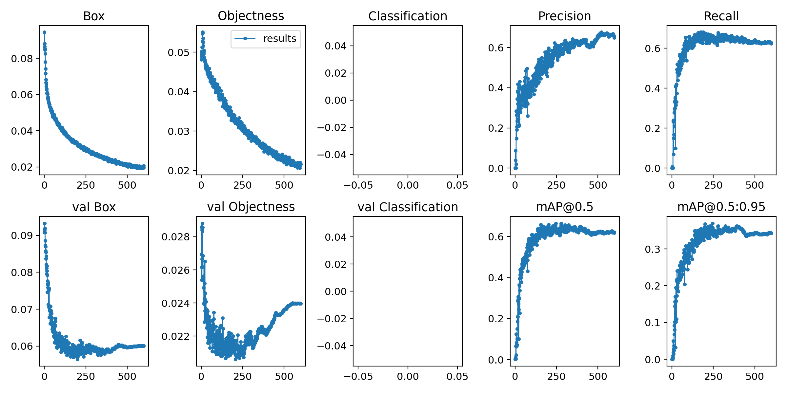
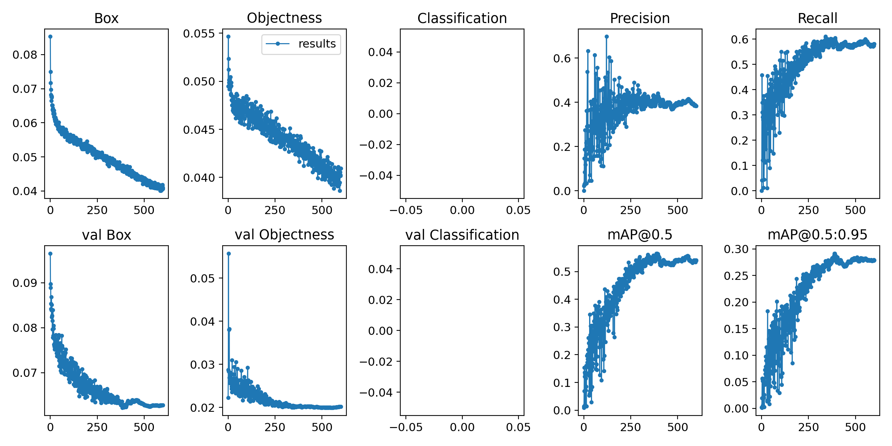
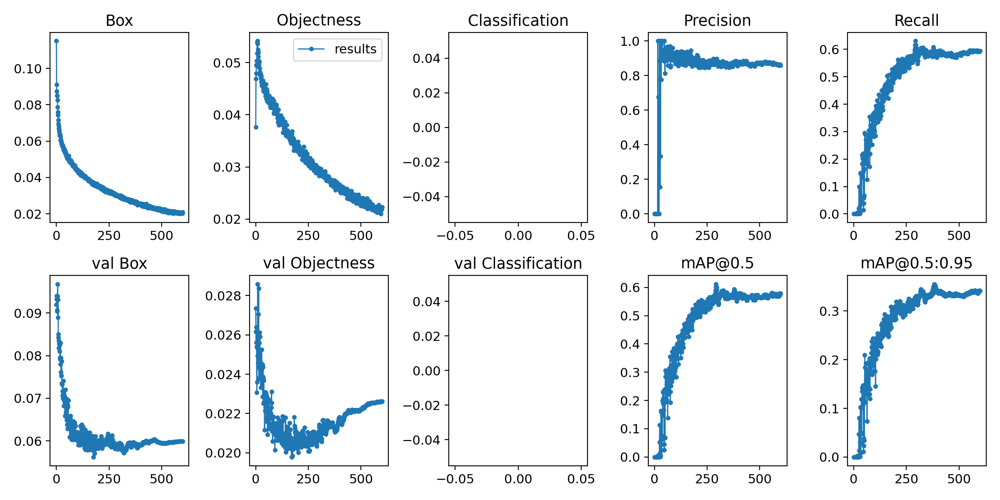

## Table of Contents  
- [Project Contents](#Project_Contents)
- [Data](#Data)  
- [Data Problem](#Data_Problem)  
- [Data Manipultation and Analysis](#Data_Manipulation_and_Analysis)  
- [Preprocessing and Modeling](#Preprocessing_and_Modeling)  
- [Reflections on the modeling process](#Reflections_on_the_modeling_process)  

## Project Contents:

The attached file contains the following files:
1. **original_eda_and_img_aug.ipynb** - This file contains the original exploratory data analysis and image augmentation of my security camera project. The first part of this notebook details image size, number of images, train/test split amounts, and information regarding data that was removed from the original image dataset. Images were augmented to increase size of training data.
2. **second_ed_and_img_aug.ipynb** - This file contains the adjustments made for the creation of my second dataset which was used on model 3.
3.**FINAL_data_aug.ipynb** - Contains adjustments made to image augmentation pipeline for the creation of my final dataset used in the final model.
4. **security_camera.ipynb** - The code used to run my final model

Attached directories:
1. **data_tools** - Tools I developed or adapted from others for use in manipulating image data
2. **results** - Results of model performance, performance snapshots with bounding boxes, graphs of metrics
3. **yolov5** - The original yolov5 directory forked from Ultralytics GitHub

## Data

Data used in this project can be seen on a University of Grenada handgun image dataset listed on [Kaggle](https://www.kaggle.com/andrewmvd/handgun-detection). Annotations from this dataset were converted from COCO ([x_min, y_min, width, height]) to YOLO (normalized[x_center, y_center, width, height]) format for future use of modeling with the [YOLO v5 model](https://github.com/ultralytics/yolov5) architecture.

## Data_Problem

Through use of a neural network utilizing the power of the YOLOv5 architecture, I have created a model that can be deployable on both still photos and live video to detect the presence of handguns, minimizing false positives on other objects. My aim is for this to be a part of a larger future project of threat detection in video surveillance. My project at present aims to detect the presence of handguns, but future ideas for this project include, but are not limited to: \
• Detection of long guns \
• Distinguishing between drawn and holstered weapons \
• Identifying police uniforms to rule out police posession of weapons \
• Detecting fire \ 
• Detecting flood waters \
• Detection of broken glass and forced entry \
 \
Upon deployment this project is immediately useful to the detection of unwanted firearms in places where they are forbidden such as schools and hospitals. Use of this or similar deployed models could be used to draw attention to or instantly alert authorities to dangerous or potentially life threatening situations and hopefully minimize their impact. 
 
## Data_Manipulation_and_Analysis

### First dataset

A large amount of time was spent physically sifting through every photo of the 2986 image dataset. 444 images were removed for various reasons. 34 were removed because they were holstered and will hopefully form part of a future dataset on holstered weapons in hopes to distinguish between weapons in a holster and those drawn. 26 were removed because they depicted non-firearm objects or were (as was the case of the majority of these images) long guns. 384 images were removed for many different reasons, including but not limited to: \
• Image depicts a cartoon weapon \
• Image is from a video game \
• Watermark too prominent \
• Poor image quality \
• Image is barely visible \
• Technical drawing \
• Wood or toy gun \
 \
Images were train/test split for modeling purposes, and training images were augmented at random to increase the 2,022 training image pool to add 8,371 augmented images for a total of 10,393. Images were augmented through a series of tranformations using the [albumentations](https://albumentations.ai/) Python package. The following transformations were made to photos during the augmentation process along with descriptions and the corresponding probability that this augmentation occured on any random image generation: \
• Flip: Flip the input either horizontally, vertically or both horizontally and vertically - 20% \
• RandomBrightnessContrast: Randomly change brightness and contrast of the input image - 20% \
• GaussNoise: Apply gaussian noise to the input image - 20% \
• HorizontalFlip: Flip the input horizontally - 30% \
• RandomSnow: Bleach out some pixel values simulating snow - 20% \
• Downscale: Decreases image quality by downscaling and upscaling back - 20% \
• HueSaturationValue: Randomly change hue, saturation and value of the input image - 30% \
• ISONoise: Apply camera sensor noise - 30% \
• InvertImg: Invert the input image by subtracting pixel values from 255 - 20% \
• MotionBlur: Apply motion blur to the input image using a random-sized kernel - 20% \
• RGBShift: Randomly shift values for each channel of the input RGB image - 20% \
• Rotate: Rotate the input by an angle selected randomly from the uniform distribution - 100% \
• ToGray: Convert the input RGB image to grayscale. If the mean pixel value for the resulting image is greater than 127, invert the resulting • grayscale image - 10% \
 \
To see how these images transformations look, please see the EDA_and_img_aug jupyter notebook attached, or visit the [albumentations demo site](https://albumentations-demo.herokuapp.com/).

### Second dataset

My second dataset built off of the original images of the University of Grenada datset. I decided to increase my data size and rethink how I was augmenting images. I added 778 new images of handguns from Google images, added bounding boxes to the data, and decided to change the train/test split to allocate only 10% of non-augmented images to the testing set (330 images). These test set images have not been augmented in any way. The reduction of test set numbers was a conscious decision I made in an effort to provide more food for training, while hopefully still providing enough images to get an accurate picture of model accuracy. Special thought and consideration for the second set of images was  taken to ensure a larger representation of images of people actually holding, shooting, or pointing firearms. Augmentation parameters were changed to decrease the amount of blur and image quality obstruction significantly from the previous dataset. In these augmentation parameters I wanted to maximize image potential and so I created rotation probabilities that were more likely to position handguns at angles close to those seen in original images, but also allow for the computer to see them in all directions for detection consideration.

The following is my final augmentation pipeline for the second data set and the probability of each occurence:

VerticalFlip - 10% \
HorizontalFlip - 40% \
RandomBrightness - 700% (p=7.0, it is a typo, I meant to type .7, but that is what it is set at) \
HueSaturationValue - 20% \ 
InvertImg - 5% \
MotionBlur - 15% \
RGBShift - 20% \
Rotate - 360 degrees in either direction - 10% \
Rotate - 50 degrees in either direction - 40%
Rotate - 20 degrees in either direction - 80%
ToGray - 20%

### Subsequent datasets

With the introduction of dividing handguns and holstered handguns into seperate classes, several data considerations were taken in hopes of optimizing predictive power in the face of similar looking objects with an imbalance in image quantity. I started with 961 images of handguns and a combined 2,661 images of semi-automatic handguns and revolvers. For initial modeling, handguns were further divided into revolver and semi-auto classes, but this was changed in the final models to just two classes: handguns and holstered handguns. To adjust for class imbalance, roughly half of the 292 testing sample were selected from each class, and each class image set was augmented to around 5,000 images from each class before being added to the training set and renamed to shuffle categories.

The final augmentation pipeline for handguns is as follows:

RandomBrightnessContrast - 60% \
VerticalFlip - 10% \
HorizontalFlip - 40% \
HueSaturationValue - 20% \ 
InvertImg - 5% \
MotionBlur - 15% \
RGBShift - 20% \
Rotate - 360 degrees in either direction - 10% \
Rotate - 50 degrees in either direction - 40% \
Rotate - 20 degrees in either direction - 80% \
ToGray - 20% \

For holsters, all augmentations were kept except for the following changes. Vertical flip was removed entirely and rotation degrees were adjusted because holsters are far less likely to be upside down than a firearms itself.

HorizontalFlip - 50% \
Rotate - 90 degrees in either direction - 10% \
Rotate - 25 degrees in either direction - 20% \
Rotate - 15 degrees in either direction - 90% \

## Preprocessing_and_Modeling

### Model 1:
I attempted my first model on the original dataset outlined above. I used an Azure VM, but in the absence of GPU availability because of cloud quotas, I was faced with a model that was going to take ten days to run before completion. After upgrading my Azure plan to include the availability of GPU heavy machines, I ran my first model on 5,147 images from the original dataset, discarding images from my initial augmentations. The model ran for 300 epochs with a batch size of 16 using stochastic gradient descent as an optimization algorithm and binary cross-entropy with logits for loss function using yolov5s default architecture. After 2.5 hours and showed promising results shown in the graphs below:

This model did well on the testing set and worked well on video. It consistently predicted the presence of firearms at some point, though often not immediately or continuously. False positives for peoples’ noses and other objects occurred often enough to warrant further data considerations implemented for the second model. 

The quest to minimize false positive detection on non-handgun object heavily influenced my decisions to add more data, restructure the dataset to include a larger training set, deliberately select images I had believed were under-represented in the original dataset (ie handguns being fired, depictions of armed robbery), and consider architectural changes. Having the unique detection problem of only predicting one class, but computing power coming in at the inexpensive price of over $3.00/hour, I researched possible ways to improve my model. Focal loss was considered, but later discarded as a possible loss function. While my model seems to have a class imbalance (only one class), the more I read, the more it seemed that focal loss could potentially increase recall at the expensive of precision: precisely what I seek to avoid. 

### Model 2:
Firmly believing that my data could be improved towards the pursuit of higher accuracy, my second model was the first to utilize my second dataset. I was curious to test the Adam optimizer, diverging from the default SGD used by YOLOv5, but will have to attempt this in subsequent modeling since not all went according to plan: The model ran for 5 hours in Azure, but only trained on augmented images, and was unable to test on any of the validation set because of an image labeling error. This error has since been corrected for my third modeling attempt.

### Model 3:
Model three was only slightly improved from my first model, and probably not worth the extra data and time spent on rethinking augmentation. Model 3 utilized my second dataset with YOLOv5s default architecture and SGD as an optimization algorithm for 500 epochs. Image size and batch size have been kept at 416 and 16 respectively in hopes of achieving higher accuracy at the expense of computational time. From my research, SGD, while it takes longer to converge, seemingly does a better job with these models. I chose to stick with SGD for the time being through research concerns and a high degree of oscilation in the tensorboard loss graph for my second model. Rather than gambling on learning rate adjustments to prevent convergence issues, SGD seemed to be a dependable choice, though again potentially at the expense of computational time.

As seen below, there was minimal improvement over past modeling:

### Micro-model tests:
I ran several smaller datasets of handgun images (1,680 images in training set and my original test set) on which to test sigmoid vs tanh activation and adam optimization against the YOLOv5 default settings.

<b>Default setting micro test</b>
 
<b>Adam optimization micro test</b>
 
<b>Tanh activation micro test</b>
 

As seen in the above results charts, use of the adam optimizer performed worse by nearly all metrics than use of the default (SGD). Tanh showed promise for continued use in providing nearly equivalent results as sigmoid activation with slightly higher precision and was able to train in over half the time. 

### Introduction of other classes for final modeling:

Having seen extremely promising results in model 3, I decided to revisit the dataset, add images, and create a 3 class system, dividing handguns into two categories: semi-automatic and revolver, and adding the category of holstered handgun. The ability to distinguish between holstered and drawn weapons was an important goal to me for the future implementation of this project in its ability to detect threats and not just objects in video. I hypothesized that by splitting handguns into two classes, that the algorithm would be able to better detect. Holster augmentation, as explained in the Data Manipulation and Analysis section of this document, was carefully planned to ensure best results. It was a mistake to have split the dataset into several classes of firearms. For threat detection, the class of firearm is only as important as its presence (and if it is drawn or not indicating threat). For my final models, only two classes were used: non-holstered handgun (handgun) and holstered handgun (holstered). 

### Final models:

I am convinced that there is merit to considering Tanh as an activation function over sigmoid, but will need to postpone further testing until future experiments. Trials using Tanh completed epochs faster than those using sigmoid activation, but experienced a delay of several hundred epochs to really kickstart into learning anything at all. Precision of these models is incredibly high, but mAP seems to only crawl slowly upwards. After 1783 epochs of Tanh trials, I decided that sigmoid has yielded more dependable results. Lacking time until the project deadline, and already having spent a fair amount of money on Azure, I opted to use a sigmoid activation for my final model. 

## Reflections_on_the_modeling_process

TBD

## Conclusions_and_Recommendations

TBD
